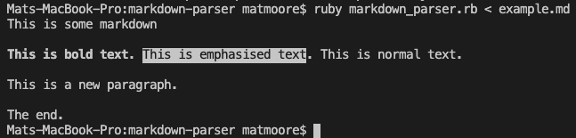

# Markdown parser

A home made artisanal markdown parser.

This parses a very small subset of markdown. It can generate formatted text in a console, using ANSI escape sequences.

## Usage

`ruby markdown_parser.rb < example.md`

## How it works
The project is split into 4 components:

- [tokenizer.rb](tokenizer.rb) - splits text into a sequence of tokens
- [parser.rb](parser.rb) - builds an abstract syntax tree (AST) from the tokens
- [generator.rb](generator.rb) - generates formatted text from the AST (using the [visitor pattern](https://en.wikipedia.org/wiki/Visitor_pattern))
- [markdown_parser.rb](markdown_parser.rb) - a simple command line interface

## References

- [Writing a Markdown Compiler](https://blog.beezwax.net/2017/07/07/writing-a-markdown-compiler/)

## Licence

MIT
